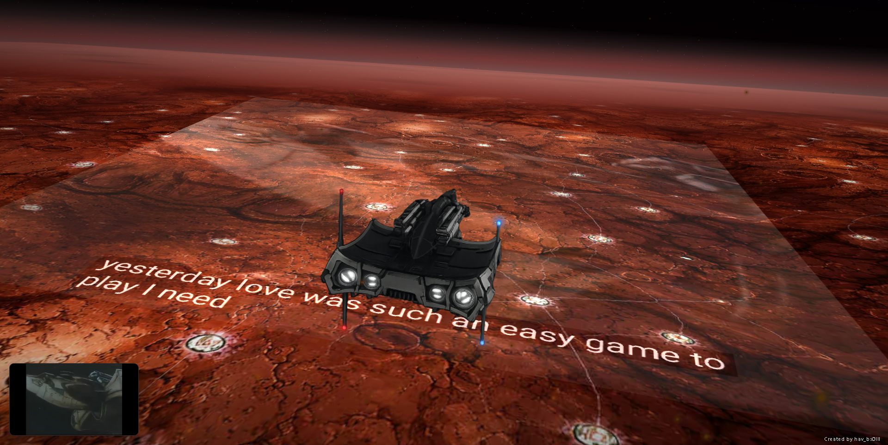

# Bebop sobre Marte — versión GitHub Pages (planos 2.5D)

Esta versión usa:

- `index.html`
- `main.js`
- `styles.css`
- `assets/background001.png`
- `assets/spaceship11.png`

## Enfoque

- La nave permanece fija en una escena overlay.
- El terreno se construye con **5 planos reciclables**.
- Cada plano usa una textura generada en el navegador **a partir de la imagen original de Marte**.
- No hay relieve 3D del suelo: el efecto es **2.5D**, con perspectiva de cámara.
- Cuando un plano pasa bajo la cámara, se recicla al fondo con una nueva variación derivada de la imagen original.

## Publicación en GitHub Pages

Sube el contenido de esta carpeta a la raíz del repositorio y habilita GitHub Pages desde:

`Settings → Pages → Deploy from a branch → main → / (root)`

## Controles

- `↑` aumentar velocidad
- `↓` reducir velocidad
- `Espacio` pausar/reanudar
- `D` mostrar depuración
